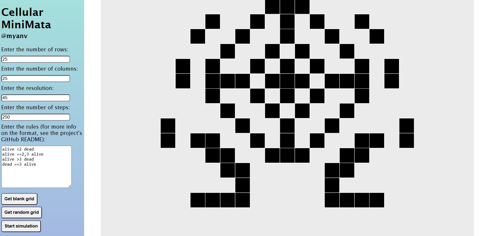

<h1 align="center"> Cellular MiniMata</h1> 
 

## About the project
This is a simple cellular automata simulator built with **Java Spring** and **JavaScript**. The user creates a custom two-dimensional grid filled with random cell states and specifies the depth (number of steps) they'd like to simulate, as well as the desired rules for the cellular automata and the initial state. By default, the ruleset follows Conway's Game of Life.

*Note: Currently the simulator runs well on grids with a number of rows and columns of less than 35.*

## Ruleset format

To input your own ruleset, follow the exact format specified here:

[Initial state] [Operator][Number of live neighbours] [End state]

For example, "alive <2 dead" is read by the program as "if the cell is initially alive and has less than 2 live neighbours, then kill it." 

Similarly, "alive ==2,3 alive" is equivalent to "if the cell is initially alive and has exactly 2 or 3 liveneighbours, then it lives on." Make sure to check for newlines or stray whitespaces.

## Reflection
The original purpose of this simulator was to recreate Conway's Game of Life in Java, a language taught in CS230 *Object-Oriented Programming* at the University of Auckland, as a small independent experiment in using OOP to simulate complex systems. Since then, it has grown into a simple full-stack web application with a JavaScript frontend, relying extensively on the p5.js library, and Java on the backend using the Spring framework. 

This is also the author's first exposure with Java Spring and full-stack development in general. Needless to say, a lot of trial-and-error and StackOverflow-ing were involved!